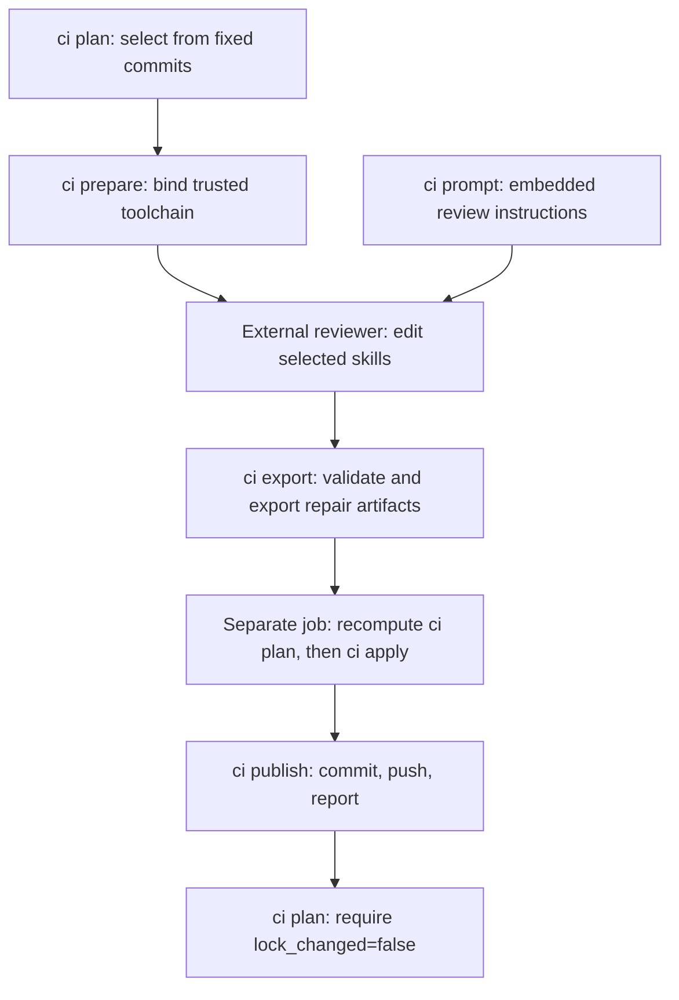

# CI integration

`skillctrl` exposes the deterministic phases of intent verification as separate
commands so that a CI platform can put a wall between them. This document is a
**command contract**, not a ready-made workflow: it states what each command
reads, what it writes, which variables it needs, and which refusals it enforces.

The sequence in [A pull request](#a-pull-request) is exercised end to end by
`TestDocumentedPhaseSequence` in `internal/integration`, so the contract below is
tested rather than asserted. Turning it into a workflow is left to the adopting
repository: the exact way a job passes artifacts, secrets, and write permissions
between steps belongs to that platform, and a sample that looks complete but is
not wired correctly is worse than none.

## Trust boundaries

| Party | Trusted with | Never trusted with |
| --- | --- | --- |
| The base commit | the checker configuration, tool pins, review contract | - |
| The pull request head | the skill content under review | the checker, the tool pins, the plan |
| The reviewing agent | its inference credential, the selected skills, their intents | any write token |
| The validating job | the write token and the recomputed plan | anything the agent asserted |

Three rules follow, and the commands enforce them:

1. **The plan is never taken from the agent.** It is recomputed from the
   trusted base and the head under review. `SKILL_PLAN` may only carry a plan a
   credential-free job produced.
2. **The checker is never taken from the incoming head.** `CHECKER_SOURCE` must
   name a commit on the trusted side. A pull request that introduces the checker
   is the one exception, and only for its own bootstrap.
3. **The agent never writes.** It runs with no write token. Everything it
   produces - a patch, a report, a partition - is input to the validating job,
   never a result.

## Environment

| Variable | Read by | Meaning |
| --- | --- | --- |
| `SKILL_PLAN` | `ci export`, `ci apply`, `ci publish`, `schedule publish` | the selection plan, as the JSON `skillctrl ci plan` printed |
| `CHECKER_SOURCE` | `ci prepare`, `ci export`, `schedule restore` | commit holding the trusted configuration |
| `OPENCODE_API_KEY` | `ci export` | the credential to screen artifacts for; it may arrive from the trusted toolchain instead of the environment |
| `GITHUB_REPOSITORY`, `PR_NUMBER` | `ci publish` | where to report |
| `DEFAULT_BRANCH`, `GITHUB_RUN_ID`, `GITHUB_RUN_ATTEMPT` | `schedule publish` | run identity and the branch to update |
| `SKILLCTRL_TOOLCHAIN_CONFIG` | `ci prepare` | trusted configuration path; default `home/dot_config/mise/config.toml` |
| `SKILLCTRL_AGENT_MODELS` | local review | trusted agent definitions; default `home/dot_pi/agent/models.json` |
| `SKILLCTRL_ADAPT_MODEL`, `SKILLCTRL_ADAPT_THINKING`, `SKILLCTRL_ADAPT_COMMAND` | local review | reviewer override; defaults `opencode-go/space-bunny-free`, `high`, `pi` |
| `SKILLCTRL_WORKTREE_PROVIDER` | `add`, `update`, `remove` | `git` (default) or `orca` |

The trusted configuration must pin a runtime and the reviewer agent and set the
release-policy settings. Only those four values are copied into the isolated
configuration the reviewer runs under; the rest of the file is ignored on
purpose, so a maintainer's unrelated tools and encrypted environment never reach
the reviewing job.

## Commands

| Command | Reads | Writes | Refuses |
| --- | --- | --- | --- |
| `skillctrl ci plan --base B [--head H] [--since S]` | Git trees at `H`, upstream registrations at `H`, the accepted lock at `H`, intent names at `H` | stdout only | an unreadable or unsupported lock |
| `skillctrl ci configure` | `CHECKER_SOURCE` | stdout only | a version range instead of an exact pin |
| `skillctrl ci prepare <dir>` | `CHECKER_SOURCE`, `SKILL_PLAN` | `<dir>/mise.toml` | a HEAD that moved since the plan was made |
| `skillctrl ci export <dir>` | `SKILL_PLAN`, the working tree, `<dir>/result.json` | `<dir>/repair.patch` | edits outside the reviewed skills; the credential in the report, result, patch, or a staged blob |
| `skillctrl ci apply <dir>` | `SKILL_PLAN`, `<dir>/repair.patch` | the Git index, `.agents/skillctrl/intents/lock.json` | a missing artifact; an oversized patch; edits outside the selection; an incomplete partition; a changed unresolved skill; a removed skill accepted |
| `skillctrl ci publish <dir>` | `SKILL_PLAN`, `<dir>/report.md`, the staged index | a commit, a push, a pull request comment | a closed, moved, forked, or self-targeted pull request; an oversized report |
| `skillctrl schedule prepare <dir>` | a clean checkout, the registered sources | a local commit, `<dir>/plan.json`, `<dir>/input.bundle` | an unauthorized path in the import; a changed upstream identity; an original whose tree does not match its record |
| `skillctrl schedule restore <dir>` | `<dir>/plan.json`, `<dir>/input.bundle`, `CHECKER_SOURCE` | the checkout, a recomputed plan on stdout | a plan that is not bound to the base; a bundle that is not a direct child of the base; a plan that differs from its own trees |
| `skillctrl schedule publish <dir>` | `SKILL_PLAN`, `<dir>/report.md`, the repository's test suites | a branch, a draft pull request | an unauthorized path; a failing test suite; a moved default branch |

`skillctrl ci prompt` prints the review contract. It is embedded in the binary, so
a job that pins a released binary has also pinned the instructions.

## A pull request



`ci prepare` does not start a model. The external workflow obtains instructions
with `skillctrl ci prompt` after preparation, then passes those instructions,
the fixed plan, and the result path to its reviewer. The reviewer has no write
token; the separate validating/publishing job receives it. Ordinary local
updates use the embedded instructions internally and do not call `ci prompt`.

The phases below are what a workflow must arrange. Each step names the
requirement, not the YAML.

1. **Select.** With a clean checkout at the pull request head, compute the plan
   against the merge base and store it as an artifact:

   ```sh
   base=$(git merge-base "$BASE_SHA" HEAD)
   skillctrl --repo . ci plan --base "$base" --head HEAD > plan.json
   ```

   Publish `plan.json`. The plan is the only thing the reviewing job may treat as
   an input, and it is recomputed again later.

2. **Decide.** If `lock_changed` is false, stop. If `needs_review` is false,
   the plan either selects registered skills without intent or only prunes
   legacy unregistered hashes: create an empty artifact directory, then run
   steps 4 and 5 against it without invoking any model. If it
   selects skills with an intent and no inference credential is available, stop
   without publishing and report the selected names: a green build that never
   checked anything is worse than a red one.

3. **Review.** In a job with **no write permission**, using one artifact
   directory for every command below - `prepare`, `export`, `apply`, and
   `publish` must all name the same directory, because that is where each one
   reads and writes:

   ```sh
   export SKILL_PLAN="$(cat plan.json)"
   export CHECKER_SOURCE="$BASE_SHA"
   skillctrl --repo . ci prepare /tmp/skillctrl    # writes /tmp/skillctrl/mise.toml
   ```

   `ci prepare` refuses without `CHECKER_SOURCE`: there is no trusted toolchain
   to bind, and an unbound run would resolve whatever the shell had installed.

   The reviewer must then be started under that toolchain. `ci prepare` only
   writes the configuration; it does not start anything. There are two working
   directories in play, and conflating them is the failure this step exists to
   prevent:

   - **Environment resolution happens in the prepared directory.** Resolving
     there is what makes the pinned tool and Node version the ones in effect,
     instead of whatever the caller's shell or the checkout would supply.
   - **The agent itself runs with the selected checkout as its working
     directory**, so the repairs it makes land in the skills being reviewed.

   Concretely, the job must:

   1. resolve the environment with the working directory set to the artifact
      directory, and take `PATH` from that result;
   2. resolve the reviewer binary to an absolute path on that `PATH`;
   3. launch the agent with that environment and with the selected checkout as
      its working directory;
   4. point `PI_CODING_AGENT_DIR` at a directory it owns that contains the
      trusted model definitions, copied from `CHECKER_SOURCE` (default
      `home/dot_pi/agent/models.json`, override with `SKILLCTRL_AGENT_MODELS`).
      An empty directory is not enough: a custom provider is configured through
      those definitions, and without them the agent has no route to the model;
   5. pass the prompt from `skillctrl ci prompt`, the plan, and the exact result
      path.

   Only `ci export` runs afterwards. It re-checks the outcome, but by then the
   agent has already run, which is why the boundary has to be established here.

   `TestDocumentedPhaseSequence` stands in for steps 1 to 5 with a resolver that
   refuses to run anywhere but the prepared directory and a reviewer that
   refuses to run anywhere but the selected checkout. Publish `repair.patch`,
   `report.md`, and `result.json`. A refused export writes no patch.

4. **Validate.** In a job with write permission, recompute the plan and compare
   it with the published one before applying anything:

   ```sh
   base=$(git merge-base "$BASE_SHA" HEAD)
   skillctrl --repo . ci plan --base "$base" --head HEAD > /tmp/skillctrl/plan.json
   diff <(jq -S . plan.json) <(jq -S . /tmp/skillctrl/plan.json)
   export SKILL_PLAN="$(cat /tmp/skillctrl/plan.json)"
   skillctrl --repo . ci apply /tmp/skillctrl
   ```

   If the recomputed plan differs, the input under review changed: stop.

5. **Publish.** With `GITHUB_TOKEN` and the pull request number:

   ```sh
   export SKILL_PLAN="$(cat plan.json)"
   skillctrl --repo . ci publish /tmp/skillctrl
   ```

   This commits the staged repair, pushes it to the pull request branch, and
   posts the report once. A rerun of the same review does not post twice.

6. **Gate.** The run is finished only when a recomputed plan at the resulting
   `HEAD` reports `lock_changed: false`. Publish that state so the gate can read
   it, and fail when the file is missing or reports unresolved skills. Without a
   published state the outcome is unknown, not resolved - a job that legitimately
   had nothing to do must still publish it, or say explicitly that it was skipped.

## A scheduled update

1. **Prepare**, in a job with no write permission to the repository:

   ```sh
   git config user.name  "github-actions[bot]"
   git config user.email "41898282+github-actions[bot]@users.noreply.github.com"
   mkdir -p input
   skillctrl --repo . schedule prepare input > update.json
   ```

   Publish `update.json`, `input/plan.json`, and `input/input.bundle` when
   `changed` is true. On a rerun with an open update pull request this returns
   `existing_pr` instead of preparing a second input.

2. **Restore and adapt** in a separate job. It re-derives the plan from the base,
   verifies the bundle is a direct child of that base, and checks that the import
   changed nothing but registered originals, their records, and the relative
   links:

   ```sh
   export CHECKER_SOURCE="$BASE_SHA"
   skillctrl --repo . schedule restore input > /tmp/skillctrl/plan.json
   export SKILL_PLAN="$(cat /tmp/skillctrl/plan.json)"
   # then the review and validate steps above
   ```

3. **Publish.** `skillctrl schedule publish` runs every `tests/*.test.sh` and
   `.agents/skillctrl/*.test.sh` suite, refuses to continue if the default branch
   moved, and opens one **draft** pull request. Nothing is merged automatically.
   It needs "Allow GitHub Actions to create and approve pull requests" enabled.

## Not covered here

- A ready-made workflow file. Wiring the steps above into a specific platform is
  left to the adopting repository; no sample is shipped because a plausible but
  unwired one would be read as supported.
- A live reviewer. The contract is verified on both sides of the boundary with a
  stub agent; nothing here demonstrates that a real model produces a patch that
  passes the same validation.
- Orca worktree creation. `--worktree-provider orca` is implemented and was
  exercised against a live Orca during this port; see the gaps section of
  [parity.md](parity.md) for exactly what was and was not covered.

Scheduled acquisition honors `--adapter skills|gh|git` and `SKILLCTRL_ADAPTER`,
with the same default as local commands. Install the selected command through
mise in the acquisition job. The trusted restore/validation job checks the
prepared immutable input and needs neither installer nor model credentials.
